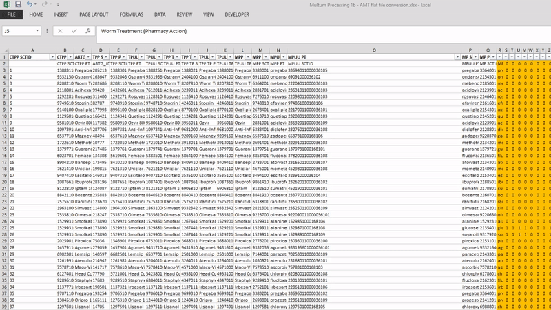

# Multum Process
[HOME](index.md)

##  Obtain the latest version of Australian Medicines Terminology (AMT) flat file
Download from [here](https://www.healthterminologies.gov.au/access/other/)

##  Obtain the latest version Cerner's drug content package
Download from somewhere in [here](https://distributions.cerner.com/package-dashboard.asp). Or hopefully Cerner sent you an automated email to download the file as it became available.

after you download the package change the file extension to .zip so that you can access the files within it. It will have at least one csv file inside the zip file.

*Note: The last package had this link: https://distributions.cerner.com/pkg/pkg_details.asp?pkg=353307
and had the name "Multum (AU): Drug Content"*

## file processing

convert "multum_ndc_snomed_reltn.csv" to "multum_ndc_snomed_reltn.xlsx" Where the output is text. This stops excel converting values to scientific notification. This can be done with your python script..

    file_dir = r'C:\Users\whittlj2\data\input.csv'
    output_dir = r'C:\Users\whittlj2\data\output.xlsx'
    delimiter = '|'
    data_type = 'str'

    import pandas as pd

    df_file = pd.read_csv(
        file_dir
        , sep = delimiter
        , dtype=data_type
        , engine = 'python')

    df_file.to_excel(output_dir, index = False)

## Import ‘multum_ndc_snomed_reltn.csv’ file into Excel
import "multum_ndc_snomed_reltn.csv" as text into excel. One way to do this is to copy from Jupyterlab into Excel. Or (from within Excel) import the .txt file as text.

*Note: This is done so that excel does not mess with the numbers and convert them into scientific notation.*

Delete data in columns A:O on the ‘multum_ndc_snomed_reltn’ worksheet of ‘Multum Processing 1b – AMT flat file conversion.xlsx’

Make sure that the column names are the same as in the ‘multum_ndc_snomed_reltn’ worksheet of ‘Multum Processing 1b – AMT flat file conversion.xlsx’.

Copy the data from ‘multum_ndc_snomed_reltn.txt’ and paste into columns A:O on the ‘multum_ndc_snomed_reltn’ worksheet of ‘Multum Processing 1b – AMT flat file conversion.xlsx’

•	Paste the data into row 2, to ensure the column headers of ‘multum_ndc_snomed_reltn.txt’ match the column headers of the ‘multum_ndc_snomed_reltn’ worksheet 
j.	Delete row 2 if the headers match.
k.	Close ‘multum_ndc_snomed_reltn.txt’.

## 1.2.10.	Import the AMT flat file into Excel

copy the amtYYYYMMDD.csv file into excel into A2 of sheet named "AMT Flat file"

Delete row 2 if headers match as below

